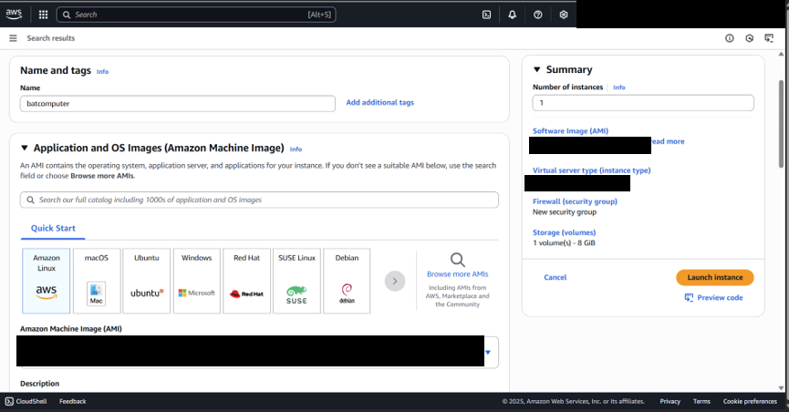
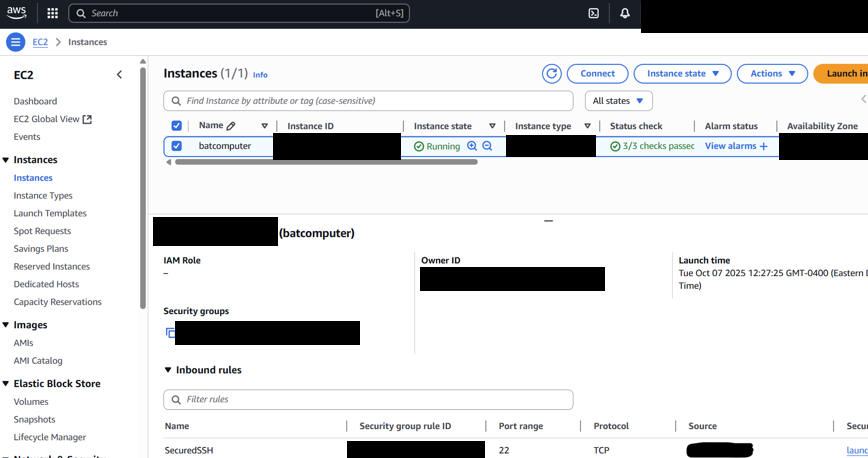
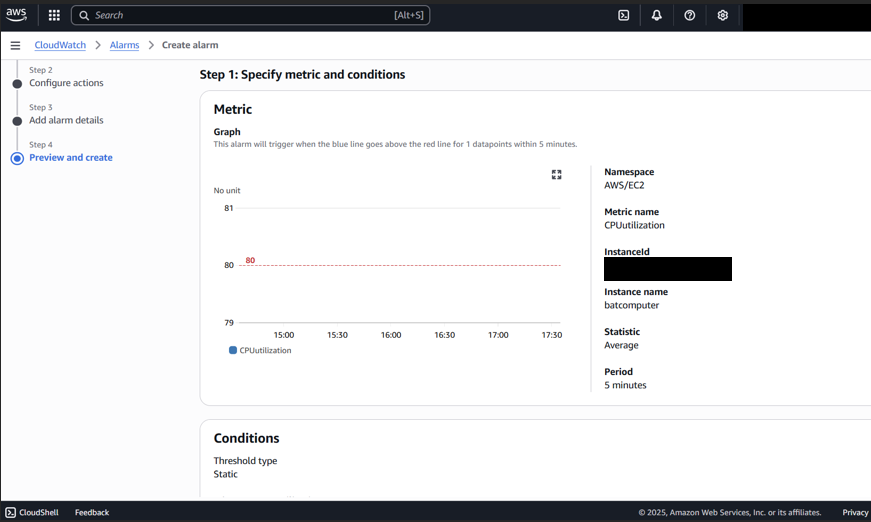
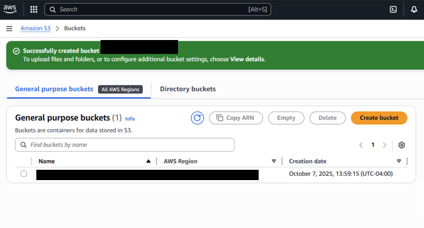
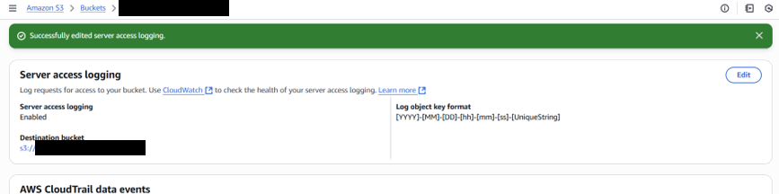

# Building a Secure AWS Cloud Environment - by Gabriel Nieves

## Section 1: Creating and Securing an EC2 Instance
Step 1.) Launching an EC2 Instance
1.	From AWS Management Console, navigated to EC2 Dashboard and pressed the “Launch EC2 Instance” button.
2.	Named the instance "batcomputer", selected the “Amazon Linux 2023 kernel-6.1” AMI, selected the “t3.micro” instance type, and used default storage settings.
3.	Configured Security Group (firewall) to allow SSH from my IP address and created an RSA key pair.
4.	Launched the EC2 instance.

*Figure 1: Creating an EC2 Instance*

Step 2.) Connecting to the EC2 Instance
1.	Opened the terminal and navigated to the directory where the key pair is stored.
2.	Using terminal, I ran a command to SSH into the batcomputer EC2 instance.
3.	Acquired a successful SSH connection.

Step 3.) Updating and Securing the EC2 Instance.
1.	Upon connecting to the EC2 Instance, I immediately ran the `sudo yum update -y` and `sudo yum upgrade -y` commands to check for and install the latest updates.
2.  Created a new administrative user account to avoid using the root user for daily tasks.
3.	Secured SSH access by editing the configuration file to disable root login and to only allow key-based authentication.
4.	Restarted the SSH service using `sudo systemctl restart sshd` to apply the changes.

Step 4.) Configuring a Firewall with Security Groups
1.	Minimized Terminal, navigated to the AWS Management Console -> EC2 Dashboard -> Instances, and selected the batcomputer EC2 instance.
2.	Clicked on the batcomputer’s Security tab and clicked on the security group associated with the instance.
3.	Edited the security group's inbound rules by creating a rule named "SecuredSSH" which allows access only from my IP address.
4.	Successfully configured a security group to restrict SSH access to my IP only.

*Figure 2: Configured an Inbound Rule for a Security Group*

Step 5.) Configuring CloudWatch for Monitoring
1.	From the AWS Management Console, navigated to the CloudWatch Dashboard.
2.	Under Alarms, I created an alarm for the batcomputer EC2 instance using a CPU utilization metric.
3.	Configured the alarm with a static threshold type, a 5-minute period, and an alarm condition that gets triggered if the batcomputer’s CPU utilization surpasses 80%.
4.	Created an SNS topic to send email alerts to me if the CPU utilization metric falls outside of the defined threshold.

*Figure 3: Configuring a CloudWatch CPU Utilization Alarm*

**Section 1 Summary**: In this section, I successfully launched and connected to an Amazon EC2 Instance. I implemented security hardening by disabling root logins, enforcing key-based authentication, and restricting SSH connections using Security Groups. I also configured CloudWatch to monitor the instance’s CPU utilization, using SNS to notify me if utilization surpasses 80%. I gained hands-on experience in establishing, securing, and monitoring a cloud infrastructure.

## Section 2: Securing Data in S3 Buckets
Step 1.) Creating and Configuring an S3 Bucket
1.	In the AWS Management Console, I navigated to S3 and pressed the Create bucket button.
2.	Named the new bucket “batcomputer-secret-data” and set it for general purpose. Configured the bucket to disable ACLs, block all public access, and enable versioning. This ensures data is private, previous versions can be recovered, and ensures access is controlled through IAM roles and bucket policies.
3.	Created the bucket.

*Figure 4: Created an S3 Bucket*

Step 2.) Enabling Server-side Encryption
1.	Clicked on the batcomputer-secret-data bucket, navigated to the properties tab, and edited the bucket’s default encryption.
2.	Changed the encryption type to server-side encryption with AWS Key Management Service keys (SSE-KMS). This ensures that objects uploaded or modified into the bucket will inherit this encryption configuration (unless otherwise specified).

Step 3.) Creating an IAM for Bucket Policies
1.	From the AWS Management Console, navigated to IAM -> Users -> Create User.
2.	Create a new limited-access IAM user and configured permissions to “attach policies directly”.
3.	Finalized the creation of the IAM user

Step 4.) Setting Bucket Policies
1.	Under the batcomputer-secret-data bucket, I clicked on the permissions tab and clicked the edit button besides “Bucket policy”.
2.	I added a bucket policy in the JSON code to allow read access only for the IAM user previously created in Step 3. 
3.	This bucket policy enforces the principle of least privilege, ensuring that only that specific IAM user access objects in the batcomputer-secret-data S3 bucket.

*Figure 5: Created an S3 Bucket Policy for an IAM User*

Step 5.) Setting Up Access Logs for S3
1.	In Amazon S3, I created a new bucket called “batcomputer-secret-logs” and configured it to be private and block public access.
2.	Under the Properties tab of the batcomputer-secret-data bucket, I navigated to “Server access logging”.
3.	I enabled access logging and specified the destination for the batcomputer-secret-logs bucket, which will make it serve as the target bucket for storing logs.
4.	By implementing access logging, every r/w request to the batcomputer-secret-data bucket will generate a log entry, which will then be stored in the batcomputer-secret-logs bucket.

*Figure 6: Enabled Server Access Logging*

**Section 2 Summary**: In this section, I successfully created an S3 bucket with versioning and server-side encryption enabled. I implemented bucket policies to enforce least privilege access and configured server access logs to monitor activity. This provided me with hands-on experience in securing cloud storage and applying data protection best practices.

